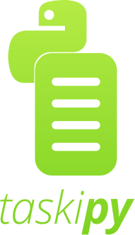

> the complementary task runner for python poetry projects


## General
Every development pipeline has tasks, such as `test`, `lint` or `publish`. With taskipy, you can define those tasks in one file and run them with a simple command.

For instance, instead of running the following command:
```bash
python -m unittest tests/test_*.py
```

You can create a task called `test` and simply run:
```bash
poetry run task test
```

In addition, you can compose tasks and group them together, and also create dependencies between them.

This project is heavily inspired by npm's [run script command](https://docs.npmjs.com/cli/run-script).

## Requirements
Python 3.5 or newer.

Your project directory should include a valid `pyproject.toml` file, as specified in [PEP-518](https://www.python.org/dev/peps/pep-0518/).

## Usage
### Installation
To install taskipy as a dev dependency, simply run:
```bash
poetry add --dev taskipy
```

### Adding Tasks 
In your `pyproject.toml` file, add a new section called `[tool.taskipy.tasks]`.

The section is a key-value map, from the names of the task to the actual command that should be run in the shell.

Example:

__pyproject.toml__
```toml
[tool.taskipy.tasks]
test = "python -m unittest tests/test_*.py"
lint = "pylint tests taskipy"
```

### Running Tasks
In order to run a task, run the following command in your terminal:
```bash
poetry run task test
```

### Composing Tasks
#### Grouping Subtasks Together
Some tasks are composed of multiple subtasks. Instead of writing plain shell commands and stringing them together, you can break them down into multiple subtasks:
```toml
[tool.taskipy.tasks]
lint_pylint = "pylint tests taskipy"
lint_mypy = "mypy tests taskipy"
```

And then create a composite task:
```toml
[tool.taskipy.tasks]
lint = "task lint_pylint && task lint_mypy"
lint_pylint = "pylint tests taskipy"
lint_mypy = "mypy tests taskipy"
```

#### Pre Task Hook
Tasks might also depend on one another. For example, tests might require some binaries to be built. Take the two following commands, for instance:
```toml
[tool.taskipy.tasks]
test = "python -m unittest tests/test_*.py"
build = "make ."
```

You could make tests depend on building, by using the **pretask hook**:
```toml
[tool.taskipy.tasks]
pre_test = "task build"
test = "python -m unittest tests/test_*.py"
build = "make ."
```

The pretask hook looks for `pre_<task_name>` task for a given `task_name`. It will run it before running the task itself. If the pretask fails, then taskipy will exit without running the task itself.

#### Post Task Hook
From time to time, you might want to run a task in conjuction with another. For example, you might want to run linting after a successful test run. Take the two following commands, for instance:
```toml
[tool.taskipy.tasks]
test = "python -m unittest tests/test_*.py"
lint = "pylint tests taskipy"
```

You could make tests trigger linting, by using the **posttask hook**:
```toml
[tool.taskipy.tasks]
test = "python -m unittest tests/test_*.py"
post_test = "task lint"
lint = "pylint tests taskipy"
```

The posttask hook looks for `post_<task_name>` task for a given `task_name`. It will run it after running the task itself. If the task failed, then taskipy will not run the posttask hook.

### Using Taskipy Without Poetry
Taskipy was created with poetry projects in mind, but actually only requires a valid `pyproject.toml` file in your project's directory. As a result, you can use it even eithout poetry:

#### Installing With PIP
Install taskipy on your machine or in your virtualenv using:
```bash
pip install taskipy
```

#### Running Tasks
Head into your project's directory (don't forget to activate virtualenv if you're using one), and run the following command:
```bash
task TASK
```
Where `TASK` is the name of your task.
